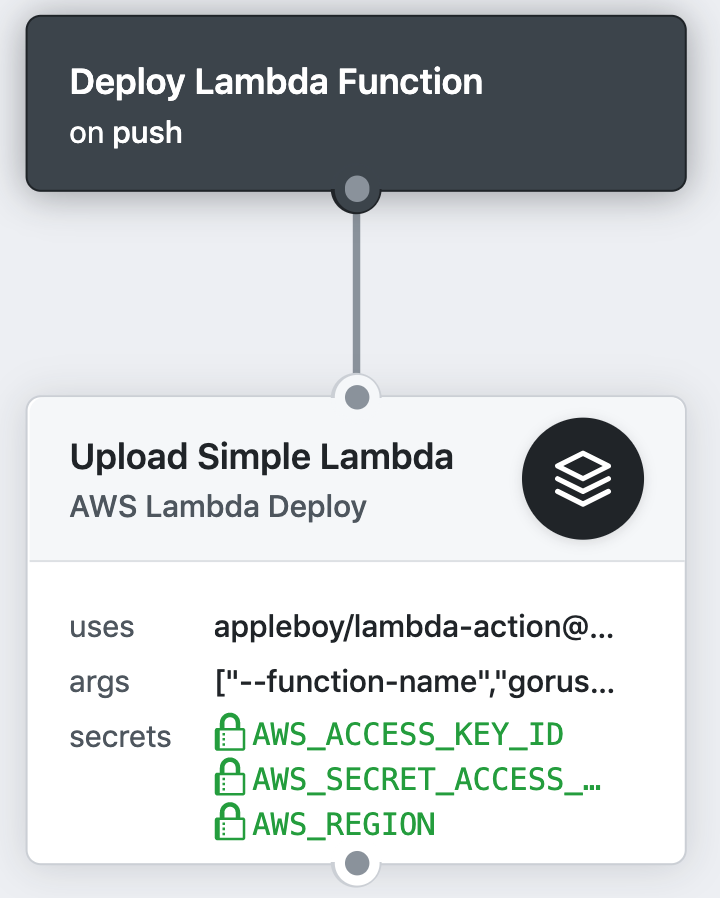

# 🚀 lambda-action

[GitHub Action](https://developer.github.com/actions/) for deploying Lambda code to an existing function



## Usage

Upload zip file to AWS Lambda function.

```
action "Upload Simple Lambda" {
  uses = "appleboy/lambda-action@master"
  secrets = [
    "AWS_ACCESS_KEY_ID",
    "AWS_SECRET_ACCESS_KEY",
    "AWS_REGION"
  ]
  args = [
    "--function-name", "hello-world",
    "--source", "main.go",
    "--source", "source.go",
    "--source", "extra.go",
  ]
}
```

## Environment variables

* ZIP_FILE - file path of zip file
* SOURCE - file list you want to zip
* S3_BUCKET - An Amazon S3 bucket in the same AWS Region as your function. The bucket can be in a different AWS account.
* S3_KEY - The Amazon S3 key of the deployment package.
* DRY_RUN - Set to true to validate the request parameters and access permissions without modifying the function code.

### Example

zip source file and upload to aws lambda.

```
action "Upload Simple Lambda" {
  uses = "appleboy/lambda-action@master"
  secrets = [
    "AWS_ACCESS_KEY_ID",
    "AWS_SECRET_ACCESS_KEY",
    "AWS_REGION"
  ]
  args = [
    "--function-name", "hello-world",
    "--source", "main.go",
    "--source", "source.go",
    "--source", "extra.go",
  ]
}
```

upload single zip file.

```
action "Upload Simple Lambda" {
  uses = "appleboy/lambda-action@master"
  secrets = [
    "AWS_ACCESS_KEY_ID",
    "AWS_SECRET_ACCESS_KEY",
    "AWS_REGION"
  ]
  args = [
    "--function-name", "hello-world",
    "--zip-file", "output.zip",
  ]
}
```

Set dry run mode to validate the request parameters and access permissions without modifying the function code.

```
action "Upload Simple Lambda" {
  uses = "appleboy/lambda-action@master"
  secrets = [
    "AWS_ACCESS_KEY_ID",
    "AWS_SECRET_ACCESS_KEY",
    "AWS_REGION"
  ]
  args = [
    "--function-name", "hello-world",
    "--zip-file", "output.zip",
    "--dry-run",
  ]
}
```

See more detail of arguments.

```
GLOBAL OPTIONS:
   --region value             AWS Region (default: "us-east-1") [$PLUGIN_REGION, $AWS_REGION]
   --access-key value         AWS ACCESS KEY [$PLUGIN_ACCESS_KEY, $AWS_ACCESS_KEY_ID]
   --secret-key value         AWS SECRET KEY [$PLUGIN_SECRET_KEY, $AWS_SECRET_ACCESS_KEY]
   --session-token value      AWS Session token [$PLUGIN_SESSION_TOKEN, $AWS_SESSION_TOKEN]
   --aws-profile value        AWS profile [$PLUGIN_PROFILE, $AWS_PROFILE]
   --function-name value      AWS lambda function name [$PLUGIN_FUNCTION_NAME, $FUNCTION_NAME]
   --s3-bucket value          An Amazon S3 bucket in the same AWS Region as your function. The bucket can be in a different AWS account. [$PLUGIN_S3_BUCKET, $S3_BUCKET]
   --s3-key value             The Amazon S3 key of the deployment package. [$PLUGIN_S3_KEY, $S3_KEY]
   --s3-object-version value  AWS lambda s3 object version [$PLUGIN_S3_OBJECT_VERSION]
   --zip-file value           AWS lambda zip file [$PLUGIN_ZIP_FILE, $ZIP_FILE]
   --source value             zip file list [$PLUGIN_SOURCE, $SOURCE]
   --dry-run                  Set to true to validate the request parameters and access permissions without modifying the function code. [$PLUGIN_DRY_RUN, $DRY_RUN]
   --help, -h                 show help
   --version, -v              print the version
```

## Secrets

* `AWS_REGION` - aws region
* `AWS_ACCESS_KEY_ID` - aws access key id
* `AWS_SECRET_ACCESS_KEY` - aws secret key
